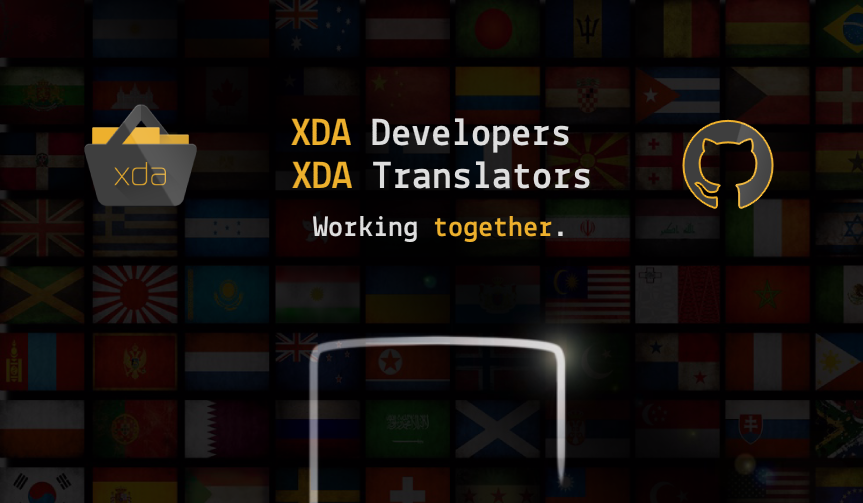

# XDA Translations
Project to manage app translations between devs and XDA translators  

## Links
* [Official XDA thread](https://forum.xda-developers.com/showthread.php?t=2069390)  
* [XDA Developers forum](https://forum.xda-developers.com)  
* [XDA Developers website](https://www.xda-developers.com)

## Developers: You need an app translation
Would you like to get your apps translated into several languages by humans and for free?

1. Create a **Pull Request** to submit your app. Please follow the guidelines.
2. Please, save resources and only ask for translation if your app is *almost* finished, you add features or make a major update. Do not ask, if your app still is changing the labeling very often.
3. On this point, after the translation, please be kind and write something in the XDA thread like "well done, we created the perfect app".

* **Credit Names**:  
If you app developers want to thank your translators, you can place their credit names (if available) somewhere in your app, for example in `About -> Credits -> Translators`. See the credit names behind the name of the XDA members in this [index](https://forum.xda-developers.com/showpost.php?p=35963995&postcount=2).

***

## Translators: Developers need you.
1. Be part of the project by contacting [gaich](https://forum.xda-developers.com/member.php?u=4563466) on XDA. Send him a PM and he will add you to this index of **recognized translators**. Thank you!
Tell him the language(s) you can translate apps into. Don't hesitate if there is already a translator for your language, it's better to have more than one for each language.
2. Verify his entry and subscribe to the XDA thread and this Github repository to get the latest news and app translate requests.
3. If there is a request for translating an app, do it. If you think you can improve an existing translation, dive into its discussion.  

***

## How does this repository work?
Everybody create pull requests.  
Developers to submit their apps and request modifications to existing apps. Translators to tell devs that one or more language(s) are completed.  
There are 3 branches:  
* `new_apps`: new apps which require many translations in many languages.  
* `ongoing_translations`: apps where strings are translated (almost) everywhere. Improvements are appreciated.  
* `discontinued`: don't waste your time. Those apps are no longer developed.  

***

## Let’s get started
Read [our wiki](https://github.com/Primokorn/XDA_Translations/wiki) to find all relevant information for developers and translators.
Thank you!  

Open an [issue](https://github.com/Primokorn/XDA_Translations/issues) if something is not working as expected, if you have questions or suggestions...
